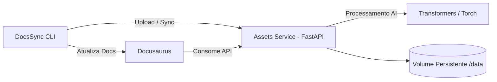

# 🚀 DocsSync

> DocsSync é um ecossistema completo para documentação técnica, unindo
> gestão inteligente de assets com um portal moderno baseado em
> Docusaurus.

------------------------------------------------------------------------

## 🧠 Visão Geral

DocsSync integra:

-   📚 Portal de Documentação (Docusaurus)
-   📦 Assets Service (FastAPI + AI)
-   🛠 CLI DocsSync (automação e sincronização)
-   🐳 Orquestração via Docker Compose
-   🔎 Busca integrada
-   🤖 Processamento inteligente de imagens

O objetivo é criar um fluxo automatizado onde documentação e assets
evoluem juntos.

------------------------------------------------------------------------

## 🏗 Arquitetura



------------------------------------------------------------------------

## 📦 Estrutura do Projeto

    docssync/
    │
    ├── assets/            # API FastAPI + AI
    ├── documentation/     # Portal Docusaurus
    ├── data/              # Volume persistente
    ├── docker-compose.yml
    └── README.md

------------------------------------------------------------------------

## 🐳 Como Executar

### 1️⃣ Build e Start

``` bash
docker compose up -d --build
```

------------------------------------------------------------------------

### 2️⃣ Acessos

  Serviço         URL
  --------------- -----------------------
  Documentation   http://localhost
  Assets API      http://localhost:8000

------------------------------------------------------------------------

## 🛠 CLI DocsSync

O CLI permite:

-   Sincronizar documentação
-   Enviar imagens para descrição automática
-   Automatizar atualização de conteúdo

### Exemplo de uso:

``` bash
docssync sync
```

Gerar descrição de imagem:

``` bash
docssync describe ./imagem.png
```

------------------------------------------------------------------------

## 🤖 Inteligência Artificial

O Assets Service suporta:

-   🖼 Descrição automática de imagens
-   🔍 OCR (opcional)
-   📑 Processamento de conteúdo técnico
-   🧠 Modelos Transformers rodando em CPU

------------------------------------------------------------------------

## 🔎 Busca no Portal

O portal utiliza busca local integrada ao Docusaurus, permitindo:

-   Busca offline
-   Indexação automática
-   Destaque de termos encontrados

------------------------------------------------------------------------

## ⚙️ Variáveis de Ambiente

Exemplo `.env`:

``` env
DOCSSYNC_API=http://localhost:8000
DOCSSYNC_DATA_PATH=./data
```

------------------------------------------------------------------------

## 🧪 Rebuild Completo

Caso precise forçar rebuild:

``` bash
docker compose down -v
docker compose build --no-cache
docker compose up -d
```

------------------------------------------------------------------------

## 🎯 Objetivo do Projeto

DocsSync resolve:

-   Desorganização de documentação técnica
-   Atualização manual repetitiva
-   Falta de padronização
-   Assets desconectados do conteúdo

Transformando documentação em um processo:

-   Automatizado
-   Inteligente
-   Versionado
-   Integrado ao fluxo de desenvolvimento

------------------------------------------------------------------------

## 🛣 Roadmap

-   [ ] Busca vetorial com embeddings
-   [ ] Integração com GitHub / GitLab
-   [ ] Versionamento automatizado
-   [ ] Pipeline CI/CD para documentação
-   [ ] Plugins de AI customizados

------------------------------------------------------------------------

## 🧩 Stack Técnica

  Camada         Tecnologia
  -------------- -------------------------------------
  API            FastAPI
  AI             Transformers + Torch (CPU)
  Docs           Docusaurus
  Orquestração   Docker Compose
  CLI            Implementação custom (Node.js / Go)

------------------------------------------------------------------------

## 📜 Licença

Definir licença apropriada (MIT recomendado).
